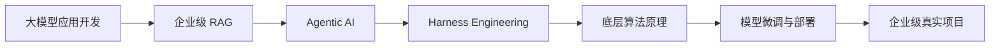

  <picture>
    <source media="(prefers-color-scheme: dark)" srcset="./assets/logo-white.png">
    <source media="(prefers-color-scheme: light)" srcset="./assets/logo-black.png">
    
  </picture>

  <strong>AI 共学社区 · 大模型应用开发 · 企业级项目实战</strong>

  <a href="https://shuh.ai">官网</a>
  ·
  <a href="https://shuh.ai/agent-course-2026">课程体系</a>
  ·
  <a href="https://shuh.ai/about">品牌介绍</a>
  ·
  <a href="https://github.com/dxzyai">GitHub</a>

  
  
  
  

---

## 我们是谁

术核AI 是一个专注 AI 大模型应用研发、企业级项目实践与人才培养的产研型品牌。我们把真实研发经验、项目交付方法和学习社区放在同一条路径上，帮助学习者从“会用模型”走向“能设计系统、能交付项目、能讲清方案”。

我们关注的不只是工具清单，而是 AI 应用进入真实业务现场时必须面对的完整链路：

| 方向 | 我们重点训练的能力 |
| --- | --- |
| AI 应用开发 | Prompt Engineering、API 调用、Spec Coding、工程上下文管理 |
| 企业级 RAG | 混合检索、重排序、GraphRAG、Agentic RAG、评估与溯源 |
| Agentic AI | LangGraph 工作流、MCP 工具接入、多 Agent 状态管理与恢复 |
| Harness Engineering | Agent 调度、治理、观测、异常恢复与生产级运行机制 |
| 模型调优部署 | LoRA / QLoRA、DeepSpeed、vLLM、FastAPI、私有化部署 |
| 真实项目交付 | 需求拆解、架构设计、工程实现、评估迭代、作品集表达 |

## AI 共学社区

术核AI 的 GitHub Profile 不是单向展示页，而是社区入口。我们希望这里逐步沉淀一套面向中文 AI 学习者和工程团队的共学资源：

- **共学路线**：围绕 RAG、Agent、模型微调、私有化部署拆解学习路径。
- **项目复盘**：把真实项目里的需求、架构取舍、评估指标和踩坑经验整理成可复用材料。
- **代码实验**：用小而完整的 Demo 验证技术点，而不是只停留在概念解释。
- **资料索引**：持续整理 LangGraph、MCP、RAGFlow、Dify、vLLM、DeepSpeed、RAGAS 等生态资源。
- **作品表达**：帮助学习者把项目经历转化为简历、作品集和面试中能讲清楚的工程叙事。

> 共学不是“资料越多越好”，而是把问题拆开、把项目做完、把经验复盘清楚。

## 课程主线

我们的课程体系围绕“从原理到交付”的能力路径设计，重点覆盖 7 个模块：

| 模块 | 关键词 |
| --- | --- |
| 01 大模型应用开发 | Token、Prompt、API、Vibe Coding、Agent 工作流 |
| 02 企业级 RAG | Native RAG、Advanced RAG、GraphRAG、Agentic RAG、RAGAS |
| 03 Agentic AI | LangGraph、ReAct、Plan-and-Execute、MCP、Skills |
| 04 Harness Engineering | 感知、规划、行动、观察、多 Agent 治理 |
| 05 底层算法原理 | 神经网络、注意力机制、Transformer、HuggingFace |
| 06 模型微调与部署 | LoRA、QLoRA、DeepSpeed、vLLM、FastAPI |
| 07 企业级项目实战 | 需求分析、架构设计、工程交付、评估复盘 |

## 实战项目

| 项目 | 训练重点 | 技术关键词 |
| --- | --- | --- |
| 跨境电商智能客服系统 | 多源文档、表格、CSV 与客服数据的知识中台 | GraphRAG、minerU、混合检索、表格推理 |
| 律所 AI 助手 | 严肃场景下的高准确率 RAG 与服务化部署 | RAG 评估、重排序、对话状态、答案溯源 |
| TradingAgents 金融决策系统 | 多智能体协作、风险分析与共识决策 | LangGraph、多 Agent、风控推理、可观测性 |
| 医疗质控模型训练平台 | 面向医疗数据的微调、推理与 Harness 评测 | LoRA、AI4Medicine、Harness、评测闭环 |

## 社区方法论

<table>
  <tr>
    <td><strong>Research</strong> 把一线研发经验沉淀成方法论。</td>
    <td><strong>Project</strong> 用真实项目验证架构、数据链路和交付标准。</td>
  </tr>
  <tr>
    <td><strong>Training</strong> 把项目难点转化为循序渐进的训练路径。</td>
    <td><strong>Feedback</strong> 依据行业需求、学员反馈和项目结果持续更新。</td>
  </tr>
</table>

## 我们会持续开源什么

- AI 应用开发学习路线图
- RAG / Agent / MCP 工程模板
- 企业级项目复盘文档
- 大模型微调与部署实验
- 面向求职作品集的项目表达模板
- 中文 AI 工程化资料索引

## 适合谁加入

- 正在从后端、前端、数据、算法转向 AI 应用开发的工程师
- 想系统补齐 RAG、Agent、模型部署能力的学习者
- 需要把 AI 项目做成可展示作品集的求职者
- 希望推动业务团队理解并落地 AI 应用的企业团队
- 愿意参与中文 AI 工程化共学、共创和复盘的开发者

## 技术栈雷达

  <code>LangGraph</code>
  <code>MCP</code>
  <code>RAGFlow</code>
  <code>Dify</code>
  <code>RAGAS</code>
  <code>vLLM</code>
  <code>DeepSpeed</code>
  <code>FastAPI</code>
  <code>HuggingFace</code>
  <code>LLaMA-Factory</code>
  <code>Qwen</code>
  <code>MiniMind</code>

---

  <strong>笃行而致远，智元以共学。</strong>

  如果你也在构建 AI 应用、复盘项目、学习 RAG / Agent / 模型部署，欢迎关注我们的仓库与社区更新。

